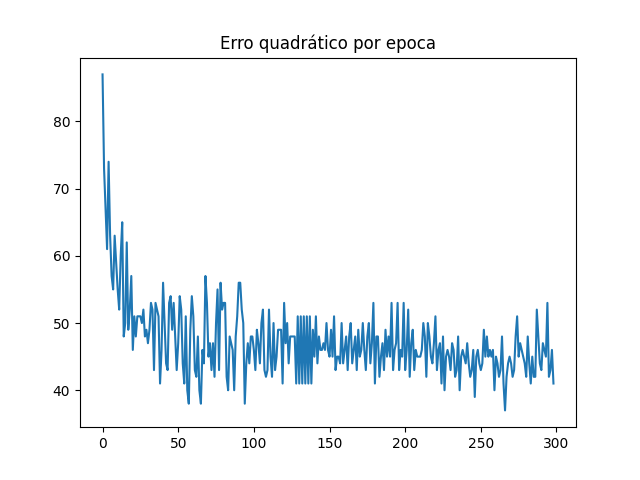
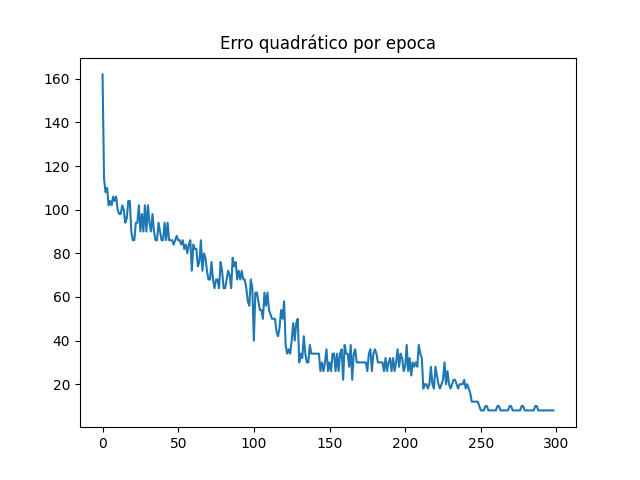

# Algoritmo de Redes Neurais (Perceptron)

## Introdução

O algoritmo possui como intuito o treinamento de uma rede neural artificial com
3 neurônios e uma camada para a classificação de flores do dataset passado. O algoritmo
possui duas funções de ativação, degrau e sigmoide, e realiza o aprendizado com base nos
valores de época e taxa de aprendizado definidas.

## Comparação

Utilizando o algoritmo com o dataset passado dois testes foram realizados. Usando 300 épocas
e uma taxa de aprendizado de 0.1 os seguintes resultados foram obtidos:

A imagem acima exibe a soma do erro quadrático por época utilizando a função degrau para a ativação.
A acurácia obtida foi de `0.45`.

A imagem acima exibe a soma do erro quadrático por época utilizando a função sigmoide para a ativação.
A acurácia obtida foi de `0.99`.

Com base nas imagens percebemos que devido a natureza da função de ativação sigmodal ser mais sensível
aos valores previstos, gerando um ajuste com base no neurônio de maior representatividade, obtivemos
uma acurácia significativamente maior que quando comparado com a função degrau. Essa por sua vez, possui
um ajuste muito bruto após um determinado limiar, em nosso caso o 0, fazendo com que os valores previstos
fossem bem mais determinísticos.