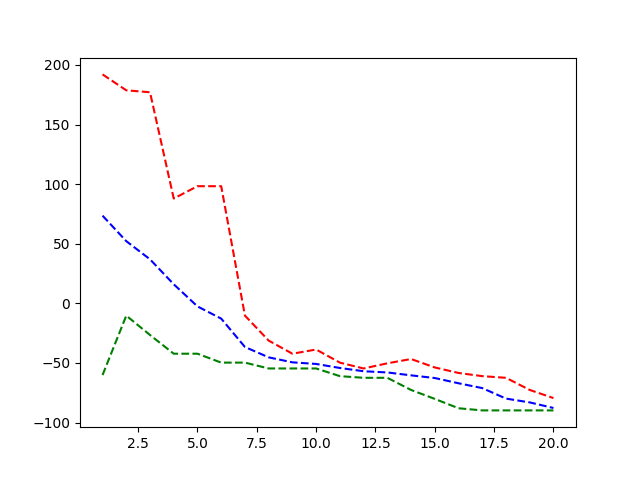

# Laboratório de Inteligência Artificial - Prática 6
## Algoritmos Genéticos
### Alunos: Isaque Fernando e Daniel Santana

#### Requisitos
``` bash
sudo apt install python3-tk
pip3 install -r requirements.txt
```

#### Para executar o programa
O programa pode ou não receber argumentos a partir de sua execução na linha de comando.
- Caso não sejam passados argumentos, o algoritmo irá rodar com os seguintes valores padrão: população de tamanho 20, taxa de crossover de 70%, taxa de mutação de 10% e máximo de 20 gerações.
- Caso seja desejável passar argumentos diferentes, estes valores podem ser passados pela linha de comando, mas obedecendo a ordem: tam_populacao(int), taxa_de_crossover(float), taxa_de_mutacao(float), max_geracoes(int). Ex: `python main.py 15 0.6 0.1 25`

#### Resultados obtidos
##### Desempenho do algoritmo x Geração


O gráfico acima mostra o desempenho por geração do algoritmo, quando executado com os seguintes parâmetros:

- Tamanho da população: 20
- Taxa de crossover: 0.7
- Taxa de mutação: 0.1
- Máx. gerações: 20

Os tracejados vermelho, verde e azul indicam, respectivamente, os resultados do pior e melhor indivíduo, e a média dos resultados daquela geração.
Podemos perceber que os valores tendem a se convergir para um resultado final bastante rapidamente no início, e com uma atenuação a partir da décima geração, aproximadamente.

O resultado obtido com esta execução foi -87.3059, no ponto (-7.820313759195462, -3.1697637513062373)

Outros gráficos de desempenho estão disponíveis na pasta `/ìmgs` deste diretório.
